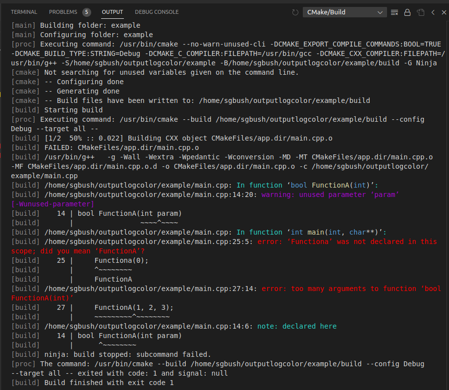

# Build Output Colorizer

Build Output Colorizer applies syntax highlighting to the VSCode Output window, restoring colors to build diagnostics that (especially with CMake builds) are stripped away.

## Features

This no-code extension associates syntax highlighting rules to the Output window scope, and uses regexes to select and highlight patterns that are probably error/warning diagnostics.




## Requirements

This extensions should not have any prerequisites or requirements.  The highlighting rules should work with any theme, but the colors are not theme-based (though they are customizable via settings).

## Extension Settings

This extension changes the default for `editor.tokenColorCustomizations` to allow customization of the highlighting.  If you have customizations already, you may need to manually add color settings for the TextMate tokens shown below:
```
{
    "editor.tokenColorCustomizations": {
    "textMateRules": [
        {
            "scope" : "markup.other.log.error",
            "settings": { "foreground": "#FF0000" }
        },
        {
            "scope" : "markup.other.log.warn",
            "settings": { "foreground": "#c500f7cc" }
        },
        {
            "scope" : "markup.other.log.info",
            "settings": { "foreground": "#2cd3c5" }
        },
        {
            "scope" : "markup.other.log.debug",
            "settings": { "foreground": "#888585" }
        },
        {
            "scope" : "markup.other.log.highlight",
            "settings": { "foreground": "#19ff04" }
        }
    ]
    }
}
```
This also allows for customization to your preferences.

## Known Issues
This extension has a quite limited set of syntax highlighting rules since normally the objective of compiler diagnostics is to draw the user's eye to the highest priority items.

Contributions or suggestions for improvement are welcome.  Please raise an issue at the extension's repository.

## Release Notes

### 0.1.0
Initial release of Build Output Colorizer.

### 0.1.2
Refactor syntax rules and add CMake specific highlighting.

