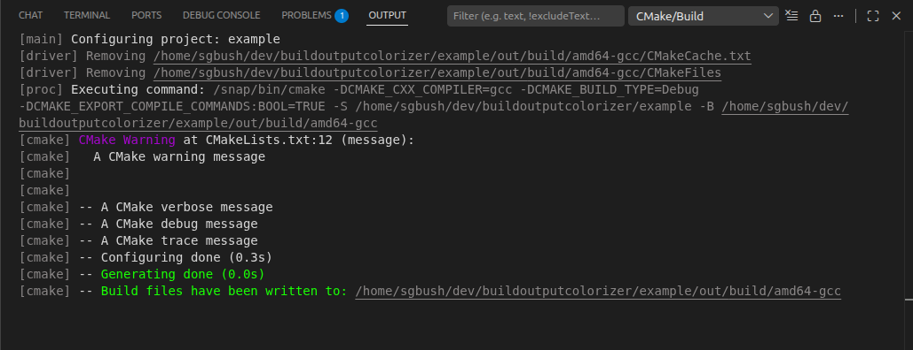
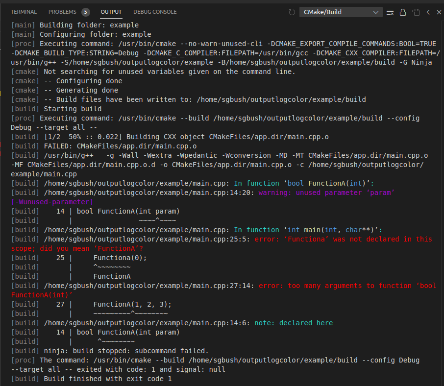

# Build Output Colorizer

Build Output Colorizer applies syntax highlighting to the VS Code Output window, restoring colors to build diagnostics that (especially with CMake builds) are stripped away.

## Features

The extension associates syntax highlighting rules to the Output window scope and uses regexes to match error, warning, info, debug, and progress patterns from GCC, Clang, MSVC, and CMake.

By default the extension is **static**: it uses fixed colors defined in `editor.tokenColorCustomizations`. Optionally, it can be switched to **theme-tracking mode**, where it reads your active VS Code color theme's terminal ANSI colors and applies them automatically — updating whenever you switch themes.




## Requirements

No prerequisites. The highlighting rules work with any theme.

## Extension Settings

### Theme-Tracking Mode (optional)

Enable this to have the extension automatically derive highlight colors from the active theme's terminal ANSI palette. Colors will update whenever the theme changes.

```jsonc
// settings.json
{
    // Enable theme-tracking mode (default: false)
    "buildOutputColorizer.useTerminalColors": true
}
```

When enabled, the extension maps each log scope to a terminal ANSI color key. The defaults are:

| Scope | Default ANSI color key |
|---|---|
| Error | `terminal.ansiRed` |
| Warning | `terminal.ansiYellow` |
| Info | `terminal.ansiCyan` |
| Debug | `terminal.ansiBrightBlack` |
| Highlight | `terminal.ansiGreen` |

Override any mapping to a different ANSI color from the 16-color palette:

```jsonc
{
    "buildOutputColorizer.useTerminalColors": true,
    "buildOutputColorizer.errorColorKey":     "terminal.ansiBrightRed",
    "buildOutputColorizer.warnColorKey":      "terminal.ansiYellow",
    "buildOutputColorizer.infoColorKey":      "terminal.ansiBrightCyan",
    "buildOutputColorizer.debugColorKey":     "terminal.ansiBrightBlack",
    "buildOutputColorizer.highlightColorKey": "terminal.ansiBrightGreen"
}
```

Available values for each `*ColorKey` setting:

`terminal.ansiBlack`, `terminal.ansiRed`, `terminal.ansiGreen`, `terminal.ansiYellow`,
`terminal.ansiBlue`, `terminal.ansiMagenta`, `terminal.ansiCyan`, `terminal.ansiWhite`,
`terminal.ansiBrightBlack`, `terminal.ansiBrightRed`, `terminal.ansiBrightGreen`, `terminal.ansiBrightYellow`,
`terminal.ansiBrightBlue`, `terminal.ansiBrightMagenta`, `terminal.ansiBrightCyan`, `terminal.ansiBrightWhite`

### Manual Colors (static mode)

When `useTerminalColors` is `false` (the default), colors come from `editor.tokenColorCustomizations`. The extension sets these defaults automatically, but you can override them in your `settings.json`:

```jsonc
{
    "editor.tokenColorCustomizations": {
        "textMateRules": [
            {
                "scope": "markup.other.log.error",
                "settings": { "foreground": "#FF0000" }
            },
            {
                "scope": "markup.other.log.warn",
                "settings": { "foreground": "#c500f7cc" }
            },
            {
                "scope": "markup.other.log.info",
                "settings": { "foreground": "#2cd3c5" }
            },
            {
                "scope": "markup.other.log.debug",
                "settings": { "foreground": "#888585" }
            },
            {
                "scope": "markup.other.log.highlight",
                "settings": { "foreground": "#19ff04" }
            }
        ]
    }
}
```

> **Note:** When theme-tracking mode is enabled, the extension writes to `editor.tokenColorCustomizations` in your global user settings. Disabling `useTerminalColors` removes those entries, restoring the defaults above.

### Diagnostic Logging (troubleshooting only)

By default the extension creates no output channel and produces no log output. The last thing we need is yet more output windows.  However, if colors are not behaving as expected, enable diagnostic logging to see what the extension is doing:

```jsonc
{
    "buildOutputColorizer.enableDiagnosticLogging": true
}
```

Once enabled, open `View → Output` and select **Build Output Colorizer** from the dropdown. The log shows which theme file was found, which ANSI color keys resolved to which hex values, and when `editor.tokenColorCustomizations` was written.

Disable the setting again when you are done — the output channel is disposed immediately and no further logging occurs.

## Known Issues

The author has made every attempt to create highlighting rules that go a bit beyond highlighting you would normally get in a normal terminal, but at the same time be sparing in the use of color.

The theme-tracking feature is new and depends on VSCode being consistent and well-behaved, and that themes are reasonably complete.  Since these things are not always in our control, please use the optional logging feature to troubleshoot problems.

Contributions or suggestions are welcome. Please raise an issue at the extension's repository.

## Release Notes

### 1.0.0
Add optional theme-tracking mode: when `buildOutputColorizer.useTerminalColors` is enabled, the extension reads the active theme's terminal ANSI colors and applies them to the log highlight scopes, updating automatically on theme change. Per-scope ANSI color key mappings are user-configurable.

Syntax rules were refined to generally use highlight more sparingly, and cover more cases for CMake-generated messages of interest.

### 0.1.7
Add CMake syntax highlights for pass/fail of configuration.

### 0.1.6
Add requested syntax highlight for MSVC linker errors.

### 0.1.5
Correct issue that breaks hyperlinks to files.

### 0.1.2
Refactor syntax rules and add CMake specific highlighting.

### 0.1.0
Initial release of Build Output Colorizer.
